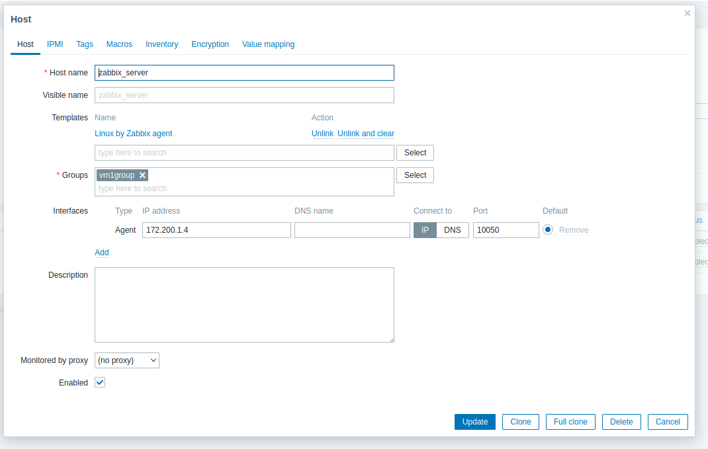
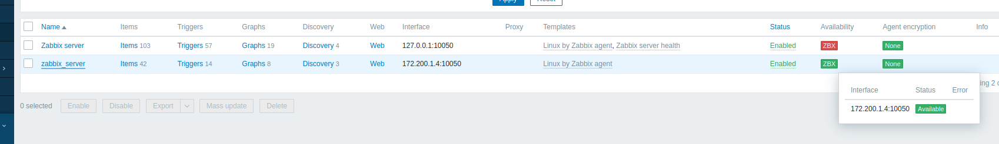

<!--The following we did was done on a VM in virtualbox called VM1 -->

<!-- The steps we took to set up the Docker containers are described below. Our final solution, utilizing virtual machines, will be shown further down in this report. -->

<!-- Even though the environments on intel1 will be referred to as VMs, they are in fact docker containers. All references to VMs before the switch from intel1 to VirtualBox will therefore refer to the docker containers named VM1, VM2 and VM3. -->
<!--  
## 2.1. VM Setup on intel1

The three preinstalled VMs had a different Ubuntu version than what was recommended in the assignment description. Therefore, to ensure that we were in line with the assignment criteria, we started by deleting them. We then built new images for the VMs, using Dockerfiles, to run the containers with their new custom configurations. The new images automatically start various services on the different containers to circumvent the problem of not having systemd in docker containers. Starting the services in the image ensures that they run on container startup, and minimizes the amount of commands we need to run manually for each container. After the images were ready, we made new containers, now with the focal fossa version, whilst also allowing for docker containers within docker containers. The following blocks of code describe what we used for building the images and running the containers, as explained above.

```bash
# building the image for VM1 from Dockerfile
sudo docker build -t vm-image1 -f data2410-portfolio2/configs/vm1-dockerfile .

# building the image for VM2 from Dockerfile
sudo docker build -t vm-image2 -f data2410-portfolio2/configs/vm2-dockerfile .

# building the image for VM3 from Dockerfile
sudo docker build -t vm-image3 -f data2410-portfolio2/configs/vm3-dockerfile .
```

```bash
# Running the VM1 container
sudo docker container run --privileged -v /var/run/docker.sock:/var/run/docker.sock -d vm_image

# Running the VM2 container
sudo docker container run --name vm2 -p 8080:8080 -d -t vm-image2

# Running the VM3 container
sudo docker container run --name vm3 -d -t vm-image3
```

The image, `vm_image`, was made from this Dockerfile:


To reach the Zabbix frontend on intel1, used an ssh tunnel to let us open the intel1 localhost:80 in our own browsers.


```bash
ssh -L 8080:localhost:80 -p 513 g13@intel1.vlab.cs.hioa.no
```
Then we could use the localhost:8080 in our browser to login with `user: Admin password: admin`

 -->


<!--
REMOVE

### Accessing zabbix web with lynx

The following code block describes how to access the `Zabbix-web`.

```bash
# This gives you a cli web browser
g13@net513:~$ lynx localhost
```

-->

<!--

## nginx with full docker path on intel1

```bash
sudo docker exec -it vm2 /bin/bash
root@47b33e945b34:/# apt-get update
root@47b33e945b34:/# apt-get install nginx
```

Once nginx has been installed, we disable the default virtual host by unlinking it with the following command.

```bash
root@47b33e945b34:/# unlink /etc/nginx/sites-enabled/default
```

Then we add `reverse-proxy.conf` to the directory `/etc/nginx/sites-available/` with the following commands.

```bash
root@47b33e945b34:/# cd /etc/nginx/sites-available/
root@47b33e945b34:/# cd nano reverse-proxy.conf
```

To complete the proxy, we activate the directives by linking to `/sites-enabled/` using the following command.

```bash
root@47b33e945b34:/etc/nginx/sites-available# ln -s /etc/nginx/sites-available/reverse-proxy.conf /etc/nginx/sites-enabled/reverse-proxy.conf
```

Lastly, to see if it works, we run an nginx configuration test and restart the service.

```bash
root@47b33e945b34:/etc/nginx/sites-available# cd
root@47b33e945b34:~# service nginx configtest
 * Testing nginx configuration                                               [ OK ]
root@47b33e945b34:~# service nginx restart
 * Restarting nginx nginx                                                    [ OK ]
root@47b33e945b34:~#
```-->

<!-- Then we set up a new host to make the active changes work, configured like this:



Proof that it is working:

 -->