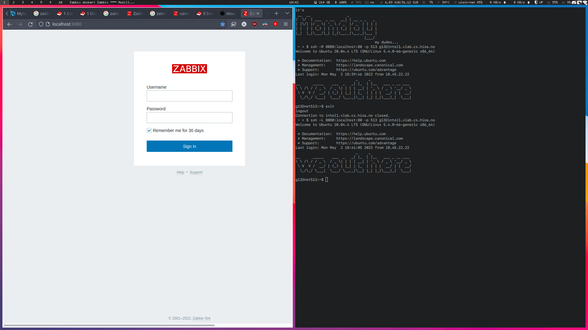
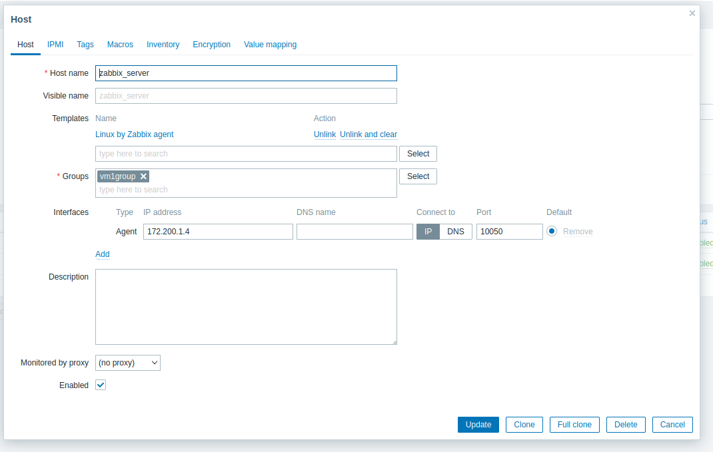
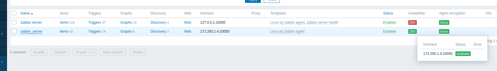

<!--  command to run:
pandoc rapport.md -s -o rapport.pdf --pdf-engine=xelatex --variable monofont="SFMono Nerd Font Mono" --toc --highlight-style=tango

to run a docker container
docker exec -it <container-id> bash
 -->

# 1. VM1: Docker containers setup 10%

## VM Setup

The three preinstalled VMs had a different ubuntu version than what was recommended in the assignment description. 
Therefore, to ensure that we were in line with the assignment description, we started by deleting them. 
We then built new images for the VMs, using Dockerfiles, to run the containers with their new custom configurations.
The new images automatically start various services on the different containers to circumvent the problem of not having systemd in docker containers. 
Starting the services in the image ensures that they run on container startup, and minimizes the amount of commands we have to run manually for each container. 
After the images were ready, we made new containers, now with the focal fossa version, whilst also allowing for docker containers within docker containers. 

The following code is what we used for building the images and running the containers, as explained above.

<!-- 
Perhaps just compress these two sets of three similar commands into just two commands and say that you swapped out the numbers?
 -->

<!-- 
TODO
- [ ] run image1
- [ ] run image2
- [ ] build image3
 -->

```bash
# building the image for VM1 from Dockerfile
sudo docker build -t vm-image1 -f data2410-portfolio2/configs/vm1-dockerfile .

# building the image for VM2 from Dockerfile
sudo docker build -t vm-image2 -f data2410-portfolio2/configs/vm2-dockerfile .

# building the image for VM3 from Dockerfile
sudo docker build -t vm-image3 -f data2410-portfolio2/configs/vm3-dockerfile .
```

```bash
# Running the VM1 container
sudo docker container run --privileged -v /var/run/docker.sock:/var/run/docker.sock -d vm_image
# Running the VM2 container

sudo docker container run --name vm2 -p 8080:8080 -d -t vm-image2
# Running the VM3 container
# Coming soon
```

The image, `vm_image`, was made from this Dockerfile:

<!--
TODO
- [ ] update this dockerfile to match not having apache
-->

```bash
TODO
- [ ] get from configs/Dockerfile
```

## Quad Container Setup

After setting up the three VMs, we used the file `docker-compose.yml`, to set up the four containers with the required config instructions for the assignment. This file can be found in the configs folder. 

```bash
TODO
- [ ] Paste finalized version of this file
```

The assignment does not specify volumes. Therefore, in order to keep the maintenance simple, we used four files from `this directory` as the volumes for each of the four containers. At first, we ran the docker containers without the volume statements to auto generate the configs, then we edited the configs and pasted them back in to a new compose file to automate our statements. The final files we used can be found below *(alt. The changes we made to the files can be found below).*

The following scripts copies configs to containers, so we can use the volumes.

```bash
g13@net513:~/data2410-portfolio2$ sudo docker cp vm_data/zabbix/zabbix_server.conf c99a6922714d:/etc/zabbix/zabbix_server.conf
g13@net513:~/data2410-portfolio2$ sudo docker cp vm_data/zabbix-agent/zabbix_agentd.conf c99a6922714d:/etc/zabbix/zabbix_agentd.conf
g13@net513:~/data2410-portfolio2$ sudo docker cp vm_data/zabbix-web/ c99a6922714d:/etc/zabbix/
```

<!--
TODO
- [ ] Specify the four files and directory in the following explanation.
- [ ] prune comments from the files to make them wayyyyy shorter
- [ ] Insert he final four files (or the changes, based on what we decide to include) RE: The final files we used can be found below (alt. The changes we made to the files can be found below)
-->

### mysql

### zabbix-server

### zabbix-web

### zabbix-agent

<!--
TODO
- [ ] få containere til å snakke sammen?
- [ ] Finialize this "chapter"
-->

# 2. VM2 and VM3: Install zabbix-agent and zabbix-proxy 10%

## VM2

We followed this guide to complete task 1 in part III of the assignment description: https://bestmonitoringtools.com/install-zabbix-proxy-on-ubuntu/
We started by installing `Zabbix proxy` on VM2 with the following commands: 
apt-get install wget
Preparing to unpack zabbix-release_6.1-1+ubuntu20.04_all.deb ...
Unpacking zabbix-release (1:6.1-1+ubuntu20.04) ...
Setting up zabbix-release (1:6.1-1+ubuntu20.04) ...
root@47b33e945b34:/# apt-get install -f

root@47b33e945b34:/# apt-get install zabbix-proxy-mysql
Reading package lists... Done
..

root@47b33e945b34:/# apt-get install zabbix-sql-scripts
```

After installing this we had to make the two VM's communicate, we initially had problems with them getting the same ip over bridged network setting i virtualbox  but fixed this by updating vm2's MAC address. Then we just had to set up the nginx.conf to map to vm1's local ip and port 80, letting us access this on vm2's local ip with port 8080 on the host machine as per the illustration in the assignment description


### MariaDB Install
The following code block describes the installation of `MariaDB` on VM2.

```bash
root@47b33e945b34:/# curl -LsS -O https://downloads.mariadb.com/MariaDB/mariadb_repo_setup
root@47b33e945b34:/# bash mariadb_repo_setup --mariadb-server-version=10.6
root@47b33e945b34:/# apt -y install mariadb-common mariadb-server-10.6 mariadb-client-10.6
```

The following code blocks set the password for new **root password** = 123.

```bash
root@47b33e945b34:/# mysql_secure_installation

Enter current password for root (enter for none):

Switch to unix_socket authentication [Y/n] y

Change the root password? [Y/n] y

Remove anonymous users? [Y/n] y

Disallow root login remotely? [Y/n] y

Remove test database and access to it? [Y/n] y

Reload privilege tables now? [Y/n] y

Thanks for using MariaDB!
```

```bash
root@47b33e945b34:/# mysql -uroot -p'123' -e "create database zabbix_proxy character set utf8mb4 collate utf8mb4_bin;"
root@47b33e945b34:/# mysql -uroot -p'123' -e "grant all privileges on zabbix_proxy.* to zabbix@localhost identified by 'zabbixDBpass';"
```

### Accessing zabbix web with lynx

<!--
TODO
- [ ] Replace with ssh-tunneling
 -->

The following code block describes how to access the `Zabbix-web`.

```bash
# This gives you a cli web browser
g13@net513:~$ lynx localhost
```

### Acessing zabbix web with ssh tunneling, setting up the new host

We needed to set up a new host on the frontend to make the active checks work, used a ssh tunnel to let us open the intel1 localhost:80 in our own browsers

<!-- 
Change to listen to 8080 to make it use the nginx proxy and make it look a bit better
 -->

```bash
ssh -L 8080:localhost:80 -p 513 g13@intel1.vlab.cs.hioa.no
```

then we could use the localhost:8080 in our browser to login with `user: Admin password: admin`



Then we set up a new host to make the active changes work, configured like this:



Proof that it is working:



<!-- 
- [ ] Need to test that the active checks are actually working now
- [ ] 
 -->

## VM 3

The following code block must be run as root on VM3 to install the `Zabbix-agent`.

<!--
TODO
- [ ] get these commands into a dockerfile
 -->

```bash
# TODO delete these, they have been put into vm3 dockerfile
 wget https://repo.zabbix.com/zabbix/6.1/ubuntu/pool/main/z/zabbix-release/zabbix-release_6.1-1%2Bubuntu20.04_all.deb

 dpkg -i zabbix-release_6.1-1+ubuntu20.04_all.deb

 apt-get install -f

 apt-get install zabbix-agent
```

The following code block creates the psk encryption key.

```bash
root@4d08e816a5a3:/# openssl rand -hex 32 > zabbix_agent.psk
root@4d08e816a5a3:/# cat zabbix_agent.psk
f62ae210eb7e91ab7908cbad2f2e8e0189f57b54e9d4de9be636e17ad362e7f7
```

The following code block moves the psk encryption key to /opt/zabbix folder. 

```bash
mkdir /opt/zabbix
chmod 777 /opt/zabbix
mv ./zabbix_agent.psk /opt/zabbix/zabbix_agent.psk
```

The following code block is an update to the `zabbix-agent.conf` file.

```bash
TLSConnect=psk
TLSAccept=psk
TLSPSKIdentity=cbt_psk_01,
TLSPSKFile=/opt/zabbix_agent.psk
```

Since we are running this in a docker container and not on an actual VM, we don´t have systemd available. Therefore, we cannot _enable_ the service, only start it, and have it as a run command in a dockerfile. This means we need to make sure that the service is started every time we run the container the dockerfile is made for.

# 3. VM2: Nginx proxy 10%

We start by creating the configuration file for the nginx-proxy. This file makes sure that the nginx-proxy listens on port 8080, and redirects all incoming traffic from that port to the `Zabbix-server` using `proxy_pass`followed by the Zabbix-server's IP address and port number.

```bash
# To be moved to /etc/nginx/sites-enabled/zabbix.conf on VM2

server {
    listen  8080;
    server_name localhost;

    location / {
        proxy_pass http://172.24.0.1:8080;
        proxy_set_header Host $http_host;
        proxy_set_header X-Real-IP $remote_addr;
        proxy_set_header X-Forwarded-For $proxy_add_x_forwarded_for;
        proxy_set_header X-Forwarded-Proto $scheme;
    }
}
```

After setting up the configuration file for the `Nginx-proxy`, we start up a terminal on VM2 and install nginx with the following commands.

```bash
sudo docker exec -it vm2 /bin/bash
root@47b33e945b34:/# apt-get update
root@47b33e945b34:/# apt-get install nginx
```

Once nginx is installed, we disable the default virtual host by unlinking it with the following command.

```bash
root@47b33e945b34:/# unlink /etc/nginx/sites-enabled/default
```

Then we add `reverse-proxy.conf` to the directory `/etc/nginx/sites-available/` with the following commands.

```bash
root@47b33e945b34:/# cd /etc/nginx/sites-available/
root@47b33e945b34:/# cd nano reverse-proxy.conf
```

To complete the proxy, we activate the directives by linking to `/sites-enabled/` using the following command.

```bash
root@47b33e945b34:/etc/nginx/sites-available# ln -s /etc/nginx/sites-available/reverse-proxy.conf /etc/nginx/sites-enabled/reverse-proxy.conf
```

Lastly, to see if it works, we run an nginx configuration test and restart the service.

```bash
root@47b33e945b34:/etc/nginx/sites-available# cd
root@47b33e945b34:~# service nginx configtest
 * Testing nginx configuration                                               [ OK ]
root@47b33e945b34:~# service nginx restart
 * Restarting nginx nginx                                                    [ OK ]
root@47b33e945b34:~#
```

This verifies that nginx works as intended.
<!-- 
All has been introduced to dockerfile to this point
You can check the tests manually after entering the dockerfile
 -->

 
To reach other docker containers, we have to use the IP address of the host machine (intel1 in this case) 172.19.0.1

```bash
root@0501deebfda5:/# curl 172.19.0.1
<!DOCTYPE html>
<html>
--------------------------------- # commented put contents of the zabbix page
root@0501deebfda5:/#
```
# 4. VM1: Zabbix frontend