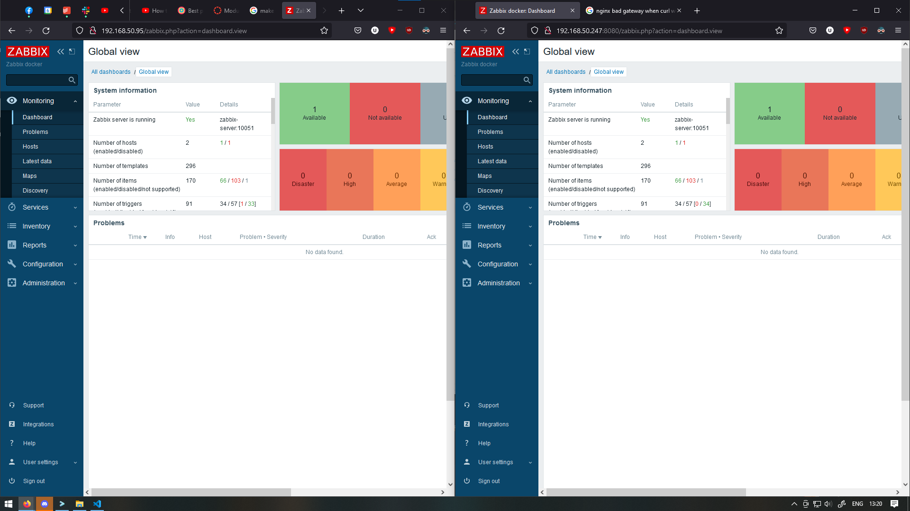
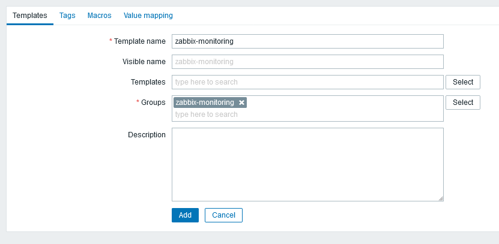
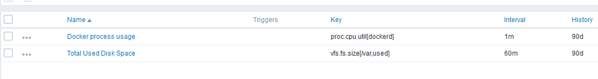
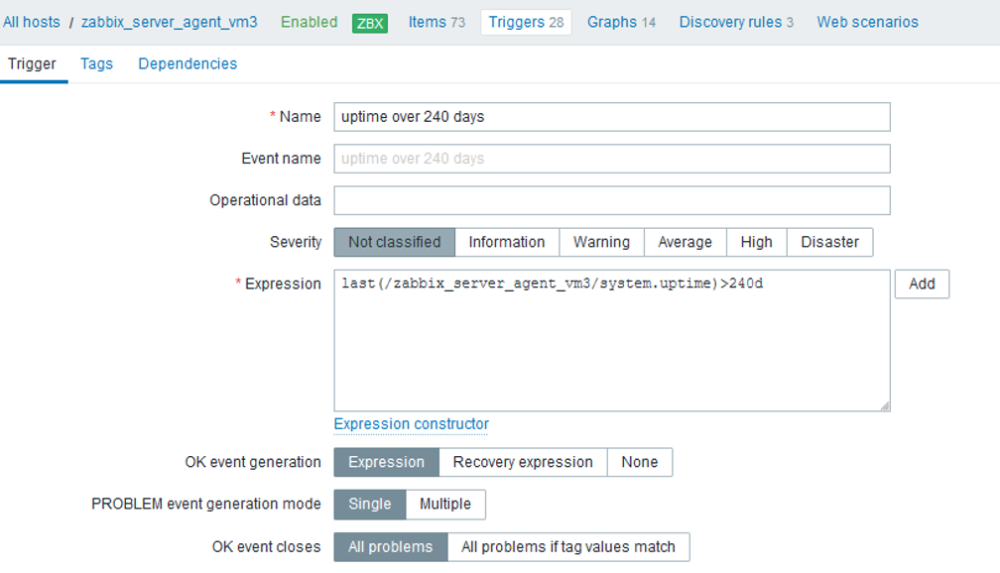
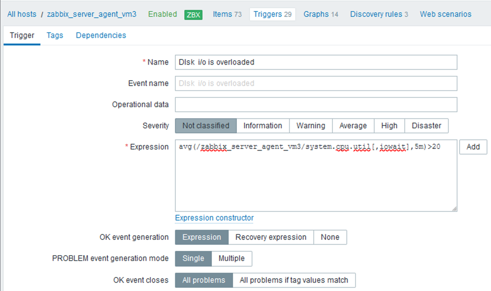
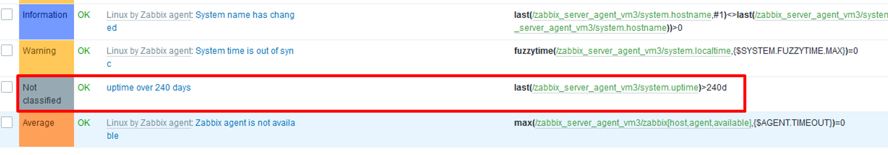
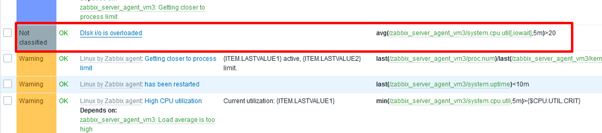

<!--  command to run:
pandoc rapport.md -s -o rapport.pdf --pdf-engine=xelatex --variable monofont="SFMono Nerd Font Mono" --toc --highlight-style=tango

to run a docker container
docker exec -it <container-id> bash
 -->

# Virtual Machines with VirtualBox

<!-- 
TODO
- [ ] Describe setup of VMs on virtual box (see introduction paragraph of report for specifics). 
-->
The first thing we needed was a VM running Ubuntu Focal Fossa.
Cloning this VM would let us create the 3 virtual machines needed for the assignment, each with 4GB of RAM and 10GB of disk space.

Therefore, We started by downloading the image for Ubuntu Focal Fossa (20.04) from: https://releases.ubuntu.com/20.04/ubuntu-20.04.4-desktop-amd64.iso and creating VM1.


<!-- -->

We set up VM1 on a bridged network, configuring it first to make sure it was working. Then, we cloned it and changed the mac address to create VM2. We cloned VM1 one more time to create VM3. Changing the mac addresses lets each VM have each their local IP on the bridged network. By doing it this way, we made sure that all three VMs could communicate with each other, whilst also being able to communicate with the host machine.

The architecture diagram in the assignment description can be interpreted to mean that we should use an internal network for all of the VMs whilst giving VM2 a second bridged network adapter. This would ensure that only the nginx proxy could reach the outside of the internal VM network. However, this would make our assignment more complicated than necessary, because the assignment didn't specify what network method to use for the VMs.

\newpage

# 1. VM1: Docker containers setup 10%

Originally, we attempted to use docker containers on the intel1-server to implement our solution. However, the server ran out of storage space, so we created virtual machines through VirtualBox as a substitute. The following we did was done on a VM in virtualbox called VM1

<!-- The steps we took to set up the Docker containers are described below. Our final solution, utilizing virtual machines, will be shown further down in this report. -->

<!-- Even though the environments on intel1 will be referred to as VMs, they are in fact docker containers. All references to VMs before the switch from intel1 to VirtualBox will therefore refer to the docker containers named VM1, VM2 and VM3. -->
 
## VM Setup on intel1

The three preinstalled VMs had a different Ubuntu version than what was recommended in the assignment description. Therefore, to ensure that we were in line with the assignment criteria, we started by deleting them. We then built new images for the VMs, using Dockerfiles, to run the containers with their new custom configurations. The new images automatically start various services on the different containers to circumvent the problem of not having systemd in docker containers. Starting the services in the image ensures that they run on container startup, and minimizes the amount of commands we need to run manually for each container. After the images were ready, we made new containers, now with the focal fossa version, whilst also allowing for docker containers within docker containers. The following blocks of code describe what we used for building the images and running the containers, as explained above.

<!-- 
Perhaps just compress these two sets of three similar commands into just two commands and say that you swapped out the numbers?
 -->

```bash
# building the image for VM1 from Dockerfile
sudo docker build -t vm-image1 -f data2410-portfolio2/configs/vm1-dockerfile .

# building the image for VM2 from Dockerfile
sudo docker build -t vm-image2 -f data2410-portfolio2/configs/vm2-dockerfile .

# building the image for VM3 from Dockerfile
sudo docker build -t vm-image3 -f data2410-portfolio2/configs/vm3-dockerfile .
```

```bash
# Running the VM1 container
sudo docker container run --privileged -v /var/run/docker.sock:/var/run/docker.sock -d vm_image
# Running the VM2 container

sudo docker container run --name vm2 -p 8080:8080 -d -t vm-image2
# Running the VM3 container
# Coming soon
```

The image, `vm_image`, was made from this Dockerfile:

<!--
TODO
- [ ] update this dockerfile to match not having apache
-->


## Quad Container Setup on intel1 / VM1

After setting up the three VMs, we used the file `docker-compose.yml`, to set up the four containers with the required config instructions for the assignment within VM1. This file can be found in the configs folder. 

```yml
# Docker Container setup for VM 1
version: "3.0"
services:
  # mysql container setup
  mysql-server:
    image: haakco/mysql80
    ports:
      - 3306
    hostname: mysql-server
    restart: unless-stopped
    volumes:
      - mysql-server-data:/var/lib/mysql
    environment:
      - MYSQL_ROOT_PASSWORD=123
      - MYSQL_DATABASE=zabbix
      - MYSQL_USER=zabbix
      - MYSQL_PASSWORD=123
    cap_add:
      - SYS_NICE
    networks:
      zabbix-net:
        ipv4_address: 172.200.1.1
    command: --default-authentication-plugin=mysql_native_password
    command: --datadir=/var/lib/mysql/data

  # zabbix server setup
  zabbix-server:
    image: zabbix/zabbix-server-mysql
    ports:
      - 10051:10051
    hostname: zabbix-server
    restart: unless-stopped
    volumes:
      - zabbix-server-config:/etc/zabbix
      - docs:/usr/share/doc/
    environment:
      - DB_SERVER_HOST=mysql-server
      - MYSQL_DATABASE=zabbix
      - MYSQL_USER=zabbix
      - MYSQL_PASSWORD=123
    depends_on:
      - mysql-server
    networks:
      zabbix-net:
        ipv4_address: 172.200.1.2

  # zabbix web container
  zabbix-web:
    image: zabbix/zabbix-web-nginx-mysql
    ports:
      - 80:8080
    hostname: zabbix-web
    restart: unless-stopped
    volumes:
      - zabbix-web-config:/etc/zabbix
    environment:
      - DB_SERVER_HOST=mysql-server
      - MYSQL_DATABASE=zabbix
      - MYSQL_USER=zabbix
      - MYSQL_PASSWORD=123
      - ZBX_SERVER_HOST=zabbix-server
    depends_on:
      - mysql-server
      - zabbix-server
    networks:
      zabbix-net:
        ipv4_address: 172.200.1.3

  # zabbix agent container
  zabbix-agent:
    image: zabbix/zabbix-agent
    ports:
      - 10050:10050
    hostname: zabbix-agent
    restart: unless-stopped
    volumes:
      - zabbix-agent-config:/etc/zabbix
    environment:
      - ZBX_SERVER_HOST=zabbix-server
    depends_on:
      - zabbix-server
    networks:
      zabbix-net:
        ipv4_address: 172.200.1.4
        
# custom network for the containers
networks:
  zabbix-net:
    driver: bridge
    ipam:
      config:
        - subnet: 172.200.1.0/16

# volumes for the containers
volumes:
  mysql-server-data:
    external: true
  zabbix-server-config:
    external: true
  zabbix-web-config:
    external: true
  zabbix-agent-config:
    external: true
  docs:
    external: true
```

When setting up the docker containers, we mostly used the auto generated docker files, but we made some minor adjustments by setting the environment variables for these files before they were generated. The environment variables were created outside the ``docker-compose.yml`` file, and later referenced in the ``docker-compose.yml`` file. We created volume links as external volumes, to make it possible to edit the files outside the docker containers via the docker volume functionality, since these volume files are synchronized with the volume files we mapped them to. The ``docs`` volume was used to get the .sql file to create the server. Setting up volumes for outside access made debugging easier while working on the project. For example we utilized this setup to look at the `zabbix_server.conf` config file to see if the environment variables in the ``docker-compose.yml`` file was correctly written in the config file. 

The following block of code describes how we set up the volumes according to the description above. 

```bash
sudo docker volume create mysql-server-data
sudo docker volume create zabbix-server-config
sudo docker volume create zabbix-web-config
sudo docker volume create zabbix-agent-config
sudo docker volume create docs
```


<!--
TODO
DELETE
- [ ] This is reedundant, delete all this
- [ ] Specify the four files and directory in the following explanation.
- [ ] prune comments from the files to make them wayyyyy shorter
- [ ] Insert he final four files (or the changes, based on what we decide to include) RE: The final files we used can be found below (alt. The changes we made to the files can be found below)
### mysql

### zabbix-server

### zabbix-web

### zabbix-agent
-->


<!--
TODO
- [x] få containere til å snakke sammen?
- [ ] Finialize this "chapter"
-->


\newpage

# 2. VM2 and VM3: Install zabbix-agent and zabbix-proxy 10%

From here on out, everything was performed on VMs using VirtualBox. 

## VM2

We followed this guide to complete task 1 in part III of the assignment description: https://bestmonitoringtools.com/install-zabbix-proxy-on-ubuntu/
There were a few things we did differently from the guide. These will be described below. 

### Innstalling Zabbix Proxy

We started by installing `Zabbix Proxy` on VM2 with the following commands: 

```bash
apt-get install wget

wget https://repo.zabbix.com/zabbix/6.0/ubuntu/pool/main/z/zabbix-release/zabbix-release_6.0-1%2Bubuntu20.04_all.deb

#needed this as well as the proxy was the wrong version
wget https://repo.zabbix.com/zabbix/6.0/ubuntu/pool/main/z/zabbix/zabbix-proxy-mysql_6.0.1-1%2Bubuntu20.04_amd64.deb

dpkg -i zabbix-release_6.1-1+ubuntu20.04_all.deb

apt-get install -f

apt-get install zabbix-proxy-mysql

apt-get install zabbix-sql-scripts
```

The only notable difference between the guide and what we did in this part of the task, is that we used Zabbix-proxy version 6.1 instead of Zabbix-proxy version 6.0, because the assignment descriptions asks us to use version 6.1.  

### Configuring database

After we finished installing `Zabbix Proxy`, we installed and configured the database, using `MariaDB`, according to both the guide mentioned above, and the assignment description. 

The following block of code describes the installation of `MariaDB` on VM2:

```bash
sudo apt install software-properties-common -y

curl -LsS -O https://downloads.mariadb.com/MariaDB/mariadb_repo_setup

sudo bash mariadb_repo_setup --mariadb-server-version=10.6

sudo apt update

sudo apt -y install mariadb-common mariadb-server-10.6 mariadb-client-10.6
```

After installing `MariaDB` we began the configuration of the database by running the following commands to start and enable MariaDB, and configure it to start on boot: 

```bash
sudo systemctl start mariadb

sudo systemctl enable mariadb
```

The next step in the configuration of the database was to reset the password. We did that with the commands in the following code block: The following code blocks set the password for new **root password** = 123.

```bash
sudo mysql_secure_installation

Enter current password for root (enter for none): Press Enter

Switch to unix_socket authentication [Y/n] y

Change the root password? [Y/n] y

New password: <Enter root DB password>

Re-enter new password: <Repeat root DB password>

Remove anonymous users? [Y/n] y

Disallow root login remotely? [Y/n] y

Remove test database and access to it? [Y/n] y

Reload privilege tables now? [Y/n] y
```

The only notable difference between the guide and what we did was that we set the root password to '123', in stead of 'rootDBpass. 

After we set the root password, it was time to create the database by running the commands in the following block of code: 

```bash
sudo  mysql -uroot -p'123' -e "create database zabbix_proxy character set utf8mb4 collate utf8mb4_bin;"
sudo mysql -uroot -p'123' -e "grant all privileges on *.* to zabbix@localhost identified by 'zabbixDBpass';"
```

The last step in the configuration of the database was to import the initial schema and data with the following command: 

```bash
sudo cat /usr/share/doc/zabbix-sql-scripts/mysql/proxy.sql | mysql -uzabbix -p'zabbixDBpass' zabbix_proxy
```
In the installation and configuration of the database, we followed the guide quite exactly. Therefore, there are very few differences between what we did to install and configure the database, and what is stated in the installation guide. 


### Configurating Zabbix Proxy

Once the installation and configuration of the database was complete, it was time to configure the `Zabbix Proxy`. The first step when configuring the `Zabbix Proxy` was to open the config file with the following command: 

```bash 
sudo gedit /etc/zabbix/zabbix_proxy.conf
```

In the file we changed the following values: 

```
DBPassword=zabbixDBpass
ConfigFrequency=100
Server=192.168.50.95
Hostname=Zabbix Proxy
DBName=zabbix_proxy
DBUser=zabbix
```

After editing the necessary values, we saved and exited the file. We configured the ConfigFrequency to be 100 seconds. This parameter determines how often the proxy retrieves data from the configuration file, and is useful to cut down on the waiting time between updates on the status of the `Zabbix Proxy`. The notable differences between our config file, and the config file in the guide is that we have a different IP address for the server, and a different hostname for the proxy itself. 


### Starting and enabling Zabbix Proxy

Next, we started and enabled the `Zabbix Proxy` to boot on startup with the following commands: 

```bash
sudo systemctl restart zabbix-proxy

sudo systemctl enable zabbix-proxy
```

Find Hostname in the zabbix-proxy config file and note. This is important in order to connect the proxy to the server in the web frontend. 
In the zabbix-proxy config find DBPassword, and make sure it is set to the correct password.  


### Registering Zabbix Proxy in the Zabbix frontend


### Accessing zabbix web with lynx

<!--
TODO
- [ ] Replace with ssh-tunneling
 -->

The following code block describes how to access the `Zabbix-web`.

```bash
# This gives you a cli web browser
g13@net513:~$ lynx localhost
```


<!--

### Accessing zabbix web with lynx

The following code block describes how to access the `Zabbix-web`.

```bash
# This gives you a cli web browser
g13@net513:~$ lynx localhost
```

-->

### Acessing zabbix web with ssh tunneling, setting up the new host

We needed to set up a new host on the frontend to make the active checks work, used a ssh tunnel to let us open the intel1 localhost:80 in our own browsers

<!-- 
Change to listen to 8080 to make it use the nginx proxy and make it look a bit better
 -->

```bash
ssh -L 8080:localhost:80 -p 513 g13@intel1.vlab.cs.hioa.no
```

then we could use the localhost:8080 in our browser to login with `user: Admin password: admin`


Then we set up a new host to make the active changes work, configured like this:


Proof that it is working:


<!-- 
- [ ] Need to test that the active checks are actually working now
- [ ] 
 -->

## VM 3

The following code block must be run as root on VM3 to install the `Zabbix-agent`.

<!--
TODO
- [ ] get these commands into a dockerfile
 -->

```bash
# TODO delete these, they have been put into vm3 dockerfile
 wget https://repo.zabbix.com/zabbix/6.1/ubuntu/pool/main/z/zabbix-release/zabbix-release_6.1-1%2Bubuntu20.04_all.deb

 #woops had to use this one for right version
 wget https://repo.zabbix.com/zabbix/6.0/ubuntu/pool/main/z/zabbix/zabbix-agent_6.0.1-1%2Bubuntu20.04_amd64.deb

 dpkg -i zabbix-release_6.1-1+ubuntu20.04_all.deb

 apt-get install -f

 apt-get install zabbix-agent
```

The following code block creates the psk encryption key.

```
ubuntu1@ubuntu1-VirtualBox:~$ openssl rand -hex 32 > zabbix_agent.psk
ubuntu1@ubuntu1-VirtualBox:~$ cat zabbix_agent.psk 
e8126679667a8594bc8d3d76121b6ba2a5fb4b6d41bea2cd62190c163fbc6c6b
```

The following code block moves the psk encryption key to /opt/zabbix folder. 

```bash
sudo mkdir /opt/zabbix
sudo chmod 777 /opt/zabbix
sudo mv zabbix_agent.psk /opt/zabbix/
```

used these commands to edit the `zabbix-agent.conf` file

```bash
ubuntu1@ubuntu1-VirtualBox:~$ sudo su
root@ubuntu1-VirtualBox:/home/ubuntu1# vim /etc/zabbix/zabbix_agentd.conf 
```

The following code block contains the lines we changed in the `zabbix-agent.conf` file.

```bash
TLSConnect=psk
TLSAccept=psk
TLSPSKIdentity=cbt_psk_01,
TLSPSKFile=/opt/zabbix_agent.psk
# the local ip of our bridged networked VM2
Server=192.168.50.247
```

Since we are running this in a docker container and not on an actual VM, we don´t have systemd available. Therefore, we cannot _enable_ the service, only start it, and have it as a run command in a dockerfile. This means we need to make sure that the service is started every time we run the container the dockerfile is made for.
\newpage

# 3. VM2: Nginx proxy 10%

We start by creating the configuration file for the nginx-proxy. This file makes sure that the nginx-proxy listens on port 8080, and redirects all incoming traffic from that port to the `Zabbix-server` using `proxy_pass`followed by the Zabbix-server's IP address and port number.

```bash
# To be moved to /etc/nginx/sites-enabled/zabbix.conf on VM2

server {
    listen  8080;
    server_name localhost;

    location / {
        proxy_pass http://172.24.0.1:8080;
        proxy_set_header Host $http_host;
        proxy_set_header X-Real-IP $remote_addr;
        proxy_set_header X-Forwarded-For $proxy_add_x_forwarded_for;
        proxy_set_header X-Forwarded-Proto $scheme;
    }
}
```

After setting up the configuration file for the `Nginx-proxy`, we start up a terminal on VM2 and install nginx with the following commands.

```bash
sudo docker exec -it vm2 /bin/bash
root@47b33e945b34:/# apt-get update
root@47b33e945b34:/# apt-get install nginx
```

Once nginx has been installed, we disable the default virtual host by unlinking it with the following command.

```bash
root@47b33e945b34:/# unlink /etc/nginx/sites-enabled/default
```

Then we add `reverse-proxy.conf` to the directory `/etc/nginx/sites-available/` with the following commands.

```bash
root@47b33e945b34:/# cd /etc/nginx/sites-available/
root@47b33e945b34:/# cd nano reverse-proxy.conf
```

To complete the proxy, we activate the directives by linking to `/sites-enabled/` using the following command.

```bash
root@47b33e945b34:/etc/nginx/sites-available# ln -s /etc/nginx/sites-available/reverse-proxy.conf /etc/nginx/sites-enabled/reverse-proxy.conf
```

Lastly, to see if it works, we run an nginx configuration test and restart the service.

```bash
root@47b33e945b34:/etc/nginx/sites-available# cd
root@47b33e945b34:~# service nginx configtest
 * Testing nginx configuration                                               [ OK ]
root@47b33e945b34:~# service nginx restart
 * Restarting nginx nginx                                                    [ OK ]
root@47b33e945b34:~#
```

This verifies that nginx works as intended.
<!-- 
All has been introduced to dockerfile to this point
You can check the tests manually after entering the dockerfile
 -->

 
To reach other docker containers, we have to use the IP address of the host machine (intel1 in this case) 172.19.0.1

```bash
root@0501deebfda5:/# curl 172.19.0.1
<!DOCTYPE html>
<html>
--------------------------------- # commented put contents of the zabbix page
root@0501deebfda5:/#
```
\newpage

## Testing zabbix-web and nginx-proxy

Here we test if we can connect to the zabbix front end by using the IP of VM1 and with the IP of VM via the nginx-proxy.



# 4. VM1: Zabbix frontend

To access the Zabbix frontend we connect to the nginx-proxy on VM2 via it's local IP and and port 8080 as specified. This redirected us to the VM1 zabbix-web docker container. Here we added the host according to the descriptions, and then made the items as per point a) and b), and the triggers as per point c) and d)


We created a new template zabbix-monitoring in the host group zabbix-monitoring with the following items and triggers:



## Items

We created the item for total disk space usage in the directory ``/var`` with interval of 1 hour:

```fsv.fs[/var,used]```

We created an that will monitor the docker process usage with interval of 1 minute:

```proc.cpu.util[dockerd]```



## Triggers

We created a trigger that triggers when uptime is longer than 240 days:

```last(/zabbix_server_agent_vm3/system.uptime)>240d```



We created a trigger that triggers when disk I/O is higher than 20% average for 5 minutes:

```avg(/zabbix_server_agent_vm3/system.cpu.util[,iowait],5m)>20```



After making those triggers we made sure that the triggers where correctly created:



