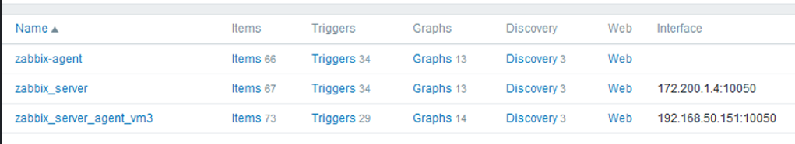

<!--  command to run:
pandoc rapport.md -s -o rapport.pdf --pdf-engine=xelatex --variable monofont="SFMono Nerd Font Mono" --toc --highlight-style=tango

to run a docker container
docker exec -it <container-id> bash
 -->

\newpage

# 1. Introduction

This report will cover our solution to the Group Portfolio 2 Assignment, given to us in the subject DATA2410. The report is divided into six separate sections. The first section is an introduction to our project. It gives a short description of our project structure, to improve the readability of this report. It also goes into detail about how we set up the VMs we used to implement our solution. The main part of this report consists of the four sections following immediately after the introduction, and will cover the steps we took to implement the different requirements in the assignment description. These requirements are mainly linked to understanding docker containers, Zabbix monitoring tools, network communication, installation and configuration of a web server. Lastly, the final and sixth section of the report will be a brief summary and conclusion of our work. 

## 1.1. Our project directory

At the beginning of the project we set up a group project directory called `portfolio2`. In this directory we decided to sort our files into different sub-folders for structure, backup and easy access purposes. The files were sorted based on their functionality and contents. Below is a list of the different sub-folders that were of significance to our project. Many of these sub-folders will be referenced in the report. 

- ``docker``: files pertaining to docker functionality  
- ``docs``: files pertaining to documentation and explanation of our project  
- ``configs``: files that aren't in use, but are kept as backup  
  - ``configs/intel1``: redundant docker files for VMs on intel1  
  - ``configs/mysql``: old mysql configuration files  
  - ``configs/nginx``: old nginx configuration files  
  - ``configs/zabbix``: old Zabbix configuration files  

## 1.2. Virtual Machines with VirtualBox 

Originally, we attempted to use docker containers on the intel1-server to implement our solution. However, the server ran out of storage space, so we created virtual machines through VirtualBox as a substitute. 

The first thing we needed was a VM running Ubuntu Focal Fossa. We needed the VM to have 4GB of RAM and 10GB of disk space. As shown in Figure 1, we downloaded the image for Ubuntu Focal Fossa (20.04) from: 
  <https://releases.ubuntu.com/20.04/ubuntu-20.04.4-desktop-amd64.iso> and created VM1 from this image.

<!-- figure 1 -->
  

The next step was to configure VM1. We started by setting up VM1 on a bridged network. The reason we started with VM1 was to make sure that it was working. We created VM2 by cloning VM1 and changing the mac address. By cloning VM1 one more time, we created VM3. By changing the MAC addresses, as shown in Figure 2, we ensured that each VM had their own local IP on the bridged network. By doing it this way, we made sure that all three VMs could communicate with each other, whilst also being able to communicate with the host machine.

<!-- figure 2 -->


The architecture diagram in the assignment description can be interpreted to mean that we should use an internal network for all of the VMs whilst giving VM2 a second bridged network adapter. This would ensure that only the nginx proxy could reach the outside of the internal VM network. Since the assignment didn't specify what network method to use for th VMs, we decided against this, because it would make our assignment more complicated than necessary.

\newpage

# 2. VM1: Docker containers setup

This section explains how we completed section II of this assignment. It includes the installation and setup of docker containers, how we configured our docker-compose stack and made the docker bridge network inside of VM1. It also covers how we used the frontend to set up the host profiles. 

## 2.1. Docker Compose Setup 

After setting up the three VMs, we used the file `docker-compose.yml`, from the docker folder in our project directory, to set up the four docker containers with the required config instructions for the assignment within VM1. The first step in setting up the docker containers was to install docker on VM1. 

We used the following command to install docker.

```bash
sudo apt-get install -y docker-compose
```

We used the auto generated docker files to set up the docker containers, but we made some minor adjustments by setting the environment variables for these files before they were generated. The environment variables were created outside the `docker-compose.yml` file, but later references in the file. We created external volumes to make it possible to edit the internal volume files from outside the docker containers via the docker volume functionality. This was possible because the volume files outside the docker containers are synchronized with the volume files we mapped them to inside the docker containers. The `docs` volume was used to get the .sql file to create the server. Setting up volumes for outside access made debugging easier while working on the project. For example we utilized this setup to verify if the environment variables in the `docker-compose.yml` file were correctly written in the `zabbix_server.conf` config file, while remaining outside the docker container containing the Zabbix Server. 

The following block of code describes how we set up the volumes according to the description above. 

```bash
sudo docker volume create mysql-server-data
sudo docker volume create zabbix-server-config
sudo docker volume create zabbix-web-config
sudo docker volume create zabbix-agent-config
sudo docker volume create docs
```

In the block below, we display our docker compose file  `docker-compose.yml` from the docker folder in our project directory. The comments in the file provide details about the functionality of the different sections of the file that are important for the implementation of the solution. 

```yml
# Docker Container setup for VM1
version: "3.0"
services:

  # mysql container setup
  mysql-server:
    image: haakco/mysql80
    ports:
      - 3306
    hostname: mysql-server
    restart: unless-stopped
    volumes:
      - mysql-server-data:/var/lib/mysql
    environment:
      - MYSQL_ROOT_PASSWORD=123
      - MYSQL_DATABASE=zabbix
      - MYSQL_USER=zabbix
      - MYSQL_PASSWORD=123
    cap_add:
      - SYS_NICE
    networks:
      zabbix-net:
        ipv4_address: 172.200.1.1
        # not supposed to have two commands put putting it on one line broke things and 
        # this seems to work
        # tried this, but it did not work:
        # command: bash -c "--default-authentication-plugin=mysql_native_password \
        # && --datadir=/var/lib/mysql/data"
    command: --default-authentication-plugin=mysql_native_password
    command: --datadir=/var/lib/mysql/data

  # zabbix server setup
  zabbix-server:
    image: zabbix/zabbix-server-mysql
    ports:
      - 10051:10051
    hostname: zabbix-server
    restart: unless-stopped
    volumes:
      - zabbix-server-config:/etc/zabbix
      - docs:/usr/share/doc/
    environment:
      - DB_SERVER_HOST=mysql-server
      - MYSQL_DATABASE=zabbix
      - MYSQL_USER=zabbix
      - MYSQL_PASSWORD=123
    depends_on:
      - mysql-server
    networks:
      zabbix-net:
        ipv4_address: 172.200.1.2

  # zabbix web container
  zabbix-web:
    image: zabbix/zabbix-web-nginx-mysql
    ports:
      - 80:8080
    hostname: zabbix-web
    restart: unless-stopped
    volumes:
      - zabbix-web-config:/etc/zabbix
    environment:
      - DB_SERVER_HOST=mysql-server
      - MYSQL_DATABASE=zabbix
      - MYSQL_USER=zabbix
      - MYSQL_PASSWORD=123
      - ZBX_SERVER_HOST=zabbix-server
    depends_on:
      - mysql-server
      - zabbix-server
    networks:
      zabbix-net:
        ipv4_address: 172.200.1.3

  # zabbix agent container
  zabbix-agent:
    image: zabbix/zabbix-agent
    ports:
      - 10050:10050
    hostname: zabbix-agent
    restart: unless-stopped
    volumes:
      - zabbix-agent-config:/etc/zabbix
    environment:
      - ZBX_SERVER_HOST=zabbix-server
    depends_on:
      - zabbix-server
    networks:
      zabbix-net:
        ipv4_address: 172.200.1.4
        
# custom network for the containers
# This is the part that meets the bridged network for docker requirements part
# of the assignment
# not to be confused with the bridged network that the VirtualBox VMs and the
# host machine are sharing
networks:
  zabbix-net:
    driver: bridge
    ipam:
      config:
        - subnet: 172.200.1.0/16

# volumes for the containers
# This is how we link the generated config files to the host machine for easy 
# debug, not required as the configs are regenerated on every run and must
# be set with environment variables, as shown above
volumes:
  mysql-server-data:
    external: true
  zabbix-server-config:
    external: true
  zabbix-web-config:
    external: true
  zabbix-agent-config:
    external: true
  docs:
    external: true
```

We used the following command on VM1 to start the docker containers with the `docker-compose.yml` file. 

```bash
sudo docker-compose up
```

After the docker containers were up and running, we decided to set up host profiles for active and passive checks between the zabbix agent and server in the docker stack, as shown in Figure 3. This was to ensure that everything was connected properly. The Zabbix frontend is hosted on VM1 port 80 as per the assignment description. At this point in the assignment we typed the address of VM1 without supplying port as it was mapped to port 80 into a web browser to access the web frontend.

<!-- 
TODO
- [ ] Consider having images of how we configured it in the front frontend along with the results already shown
 -->

We decided to split the Figure 3 image into two parts to improve the readability, same with Figure 11. These two figures displays that our docker stack is functioning correctly with fully set up hosts for both active and passive checks

 \

<!-- figure 3 -->


Figure 4 shows a screenshot of the docker compose log. It shows that all the checks except one is working between the agent and server. We assumed that this one check from the template probably wasn't suited for being run in a docker environment, because some things can be different in a docker environment. The error, however, did not reoccur so we attributed it to a minor fault in the startup process.

<!-- figure 4 -->


We believe that this section now fully explains how we installed docker and set up the four containers in a networked manner via our docker compose file, and displays competency with both conventional VMs and using the docker software.

\newpage

# 3. VM2 and VM3: Install Zabbix agent and Zabbix proxy

This section explains how we installed, configured and started a Zabbix proxy, connected to both MariaDB and our Zabbix server. It also explains how we installed and configured a Zabbix agent on VM3, and got it to communicate with the Zabbix server through the Zabbix proxy.

## 3.1. VM2: Zabbix proxy and MariaDB

We followed a guide called "Zabbix proxy: Install on ubuntu 20.04 in 10 minutes!", hereby referred to as "the guide", to complete task 1 in section III of the assignment description. There were a few differences between what we did and what the guide did while setting up Zabbix proxy. These differences will be described below.

### 3.1.1. Installing Zabbix proxy

We started by installing Zabbix proxy on VM2 with the following commands:

```bash
apt-get install wget

wget https://repo.zabbix.com/zabbix/6.0/ubuntu/pool/main/z/zabbix-release/
  zabbix-release_6.0-1%2Bubuntu20.04_all.deb

dpkg -i zabbix-release_6.0-1+ubuntu20.04_all.deb

# We needed this as well since we got the wrong version (6.2 beta) of the proxy by just downloading 
# the release package
wget https://repo.zabbix.com/zabbix/6.0/ubuntu/pool/main/z/zabbix/
  zabbix-proxy-mysql_6.0.1-1%2Bubuntu20.04_amd64.deb

dpkg -i zabbix-proxy-mysql_6.0.1-1+ubuntu20.04_amd64.deb

apt-get install -f

apt-get install zabbix-proxy-mysql

apt-get install zabbix-sql-scripts
``` 

NB: The download links we used are not the ones that were given in the assignment description. We decided against using those, because we ran into issues with the ``zabbix-release`` packages giving us the wrong version on Zabbix proxy. E.g we would end up with version 4, 5, or 6.2 beta. None of those versions were compatible with our server, which ran version 6.0. We needed the Zabbix proxy version 6.0.x, because the major release version has to be same on both server and proxy to establish a connection (Zabbix, 2019). We got our downloads from the official Zabbix repo listed in our references. 


### 3.1.2. Configuring MariaDB database for the proxy to use

After we finished installing the Zabbix proxy, we installed and configured the MariaDB database, in accordance with both the guide, and the assignment description. 

The following block of code describes the installation of MariaDB on VM2:

```bash
sudo apt install software-properties-common -y

curl -LsS -O https://downloads.mariadb.com/MariaDB/mariadb_repo_setup

sudo bash mariadb_repo_setup --mariadb-server-version=10.6

sudo apt update

sudo apt -y install mariadb-common mariadb-server-10.6 mariadb-client-10.6
```

After installing MariaDB, we began configuring the database by running the following commands to start and enable MariaDB to start on boot:

```bash
# Makes the service start on startup
sudo systemctl enable mariadb

sudo systemctl start mariadb
```

The next step in the configuration of the database was to reset the root password. We did that using the commands in the following code block: The new password for root was set to **'123'**

```bash
sudo mysql_secure_installation

Enter current password for root (enter for none): Press Enter

Switch to unix_socket authentication [Y/n] y

Change the root password? [Y/n] y

New password: <Enter root DB password>

Re-enter new password: <Repeat root DB password>

Remove anonymous users? [Y/n] y

Disallow root login remotely? [Y/n] y

Remove test database and access to it? [Y/n] y

Reload privilege tables now? [Y/n] y
```

After the root password was set, it was time to create the database by running the commands in the following block of code: 

```bash
sudo mysql -uroot -p'123' -e "create database zabbix_proxy character set utf8mb4 collate utf8mb4_bin;"

sudo mysql -uroot -p'123' -e "grant all privileges on *.* to zabbix@localhost identified by 'zabbixDBpass';"
```

The last step in the configuration of the database was to import the initial schema and data that Zabbix requires. This was done with the following command: 

```bash
sudo cat /usr/share/doc/zabbix-sql-scripts/mysql/proxy.sql | mysql -uzabbix -p'zabbixDBpass' zabbix_proxy
```

In the installation and configuration of the database, we followed the guide quite exactly. Therefore, there are very few differences between what we did to install and configure the database, and what is suggested in the guide. The only notable difference between the guide and what we did was that we set the root password to **'123'**, instead of **'rootDBpass'**. 


### 3.1.3. Configuring Zabbix proxy

Once the installation and configuration of the database was complete, it was time to configure the Zabbix proxy. The first step when configuring the Zabbix proxy was to open the config file with the following command: 

```bash 
sudo gedit /etc/zabbix/zabbix_proxy.conf
```

In the file we changed the following values: 

```bash
ConfigFrequency=100
Server=192.168.50.95
Hostname=Zabbix Proxy

# Lastly we set the database user and pass to match the database we just created
DBPassword=zabbixDBpass
DBName=zabbix_proxy
DBUser=zabbix
```

After editing the necessary values, we saved and exited the file. We set the ``ConfigFrequency`` to be 100 seconds. This parameter determines how often the proxy retrieves data from the configuration file, and is useful to cut down on the waiting time between status updates from the Zabbix proxy. We also noted the ``Hostname``, because this was needed to connect the proxy to the server in the web frontend. We also ensured the the ``DBPassword`` was set to the correct value. 

The notable differences between our config file, and the config file in the guide is that we have a different IP address for the zabbix server, and a different hostname for the proxy itself. The difference in IP address is to connect the Zabbix proxy to the right server.  

### 3.1.4. Starting and enabling the Zabbix proxy

Next, we started the Zabbix proxy and enabled it to boot on startup with the following commands: 

```bash
sudo systemctl enable zabbix-proxy

sudo systemctl start zabbix-proxy
``` 

### 3.1.5. Registering Zabbix proxy in the Zabbix frontend

Figure 5 shows how we set up the proxy in the Zabbix frontend after finishing the configuration on VM2. Figure 6 verifies that the proxy is properly connected to the server. 

<!--figure 5 this can be removed if we don't have enough space-->
 

Notable in Figure 6 is that the `last seen (age)` is less than 6s. Now we know that the proxy is connected to the server.

<!-- figure 6 -->
 


## 3.2. VM3: Zabbix Agent installation and setup 

The following code block must be run on VM3 to install the Zabbix-agent.

```bash
wget https://repo.zabbix.com/zabbix/6.0/ubuntu/pool/main/z/zabbix-release/
  zabbix-release_6.0-1%2Bubuntu20.04_all.deb

sudo dpkg -i zabbix-release_6.0-1+ubuntu20.04_all.deb

#had to use this one for right version
wget https://repo.zabbix.com/zabbix/6.0/ubuntu/pool/main/z/zabbix/
  zabbix-agent_6.0.1-1%2Bubuntu20.04_amd64.deb

sudo dpkg -i zabbix-agent_6.0-1+ubuntu20.04_amd64.deb

sudo apt-get install -f

sudo apt-get install zabbix-agent
```

The following code block creates the psk encryption key.

```bash
openssl rand -hex 32 > zabbix_agent.psk

cat zabbix_agent.psk 
e8126679667a8594bc8d3d76121b6ba2a5fb4b6d41bea2cd62190c163fbc6c6b
```

The following code block moves the psk encryption key to ``/opt/zabbix`` folder. 

```bash
sudo mkdir /opt/zabbix

sudo chmod 777 /opt/zabbix

sudo mv zabbix_agent.psk /opt/zabbix/
```

The following command was used to edit the `zabbix-agentd.conf` file

```bash
sudo vim /etc/zabbix/zabbix_agentd.conf 
```

The following code block contains the lines we changed in the `zabbix-agent.conf` file; to enable psk encryption.

```bash
TLSConnect=psk
TLSAccept=psk
TLSPSKIdentity=cbt_psk_01
TLSPSKFile=/opt/zabbix_agent.psk

# The local ip of our bridged networked VM2
Server=192.168.50.247
```

Lastly we start the agent and enable the agent to start on boot with the following commands:

```bash
sudo systemctl enable zabbix-agent

sudo systemctl start zabbix-agent
```

In the Zabbix frontend we added psk encryption to the ``zabbix_server_vm3_agent`` host as shown in Figure 7.

<!-- figure 7 -->


We believe we have now displayed in a reproducible way, how to set up the zabbix proxy and how to make an agent work through it.

\newpage

# 4. VM2: Nginx Proxy

This section explains how we installed, configured and started an nginx reverse proxy that listens on localhost, redirecting its traffic to the Zabbix-server frontend.


## 4.1. Installing Nginx Proxy and preparing configuration files

We started by installing nginx on the VM, using the following commands.

```bash
sudo apt-get update

sudo apt-get install nginx
```

Once nginx was installed, we disabled the default virtual host by unlinking it, using the following command.

```bash
sudo unlink /etc/nginx/sites-enabled/default
```

## 4.2. Applying configurations to the proxy

In order to add our new configurations to the proxy, we first moved to the `sites-available` directory. Once there, we created a new configuration file, called `reverse-proxy.conf`. We used the following command.

```bash
nano /etc/nginx/sites-available/reverse-proxy.conf
```

The newly created `reverse-proxy.conf` file and its configurations can be seen in the block below.

```bash
server {
    listen  8080;
    server_name localhost;

    location / {
        proxy_pass http://192.168.50.95:80; # Zabbix server IP
        proxy_set_header Host $http_host;
        proxy_set_header X-Real-IP $remote_addr;
        proxy_set_header X-Forwarded-For $proxy_add_x_forwarded_for;
        proxy_set_header X-Forwarded-Proto $scheme;
    }
}
```

These configurations ensures that the nginx-proxy listens on port 8080 of VM2, and redirects all incoming traffic from that port to the `Zabbix-server` using `proxy_pass`.

To clarify, VM1's local IP in the VirtualBox bridged network is `192.168.50.95` and the docker container holding the web frontend is mapped to this ip on port 80

To complete the proxy, we activated the directives by linking to `/sites-enabled/` using the following command.

```bash
sudo ln -s /etc/nginx/sites-available/reverse-proxy.conf /etc/nginx/sites-enabled/reverse-proxy.conf
```

Lastly, to see if it worked, we ran an nginx configuration test and restarted the service.

```bash
# making it run on boot to make setup permanent
sudo systemctl enable nginx

sudo systemctl start nginx

sudo systemctl configtest nginx
 * Testing nginx configuration                                               [ OK ]

sudo systemctl restart nginx
 * Restarting nginx nginx                                                    [ OK ]
```

This verifies that nginx works as intended.

Figure 8 shows the zabbix frontend being accessed from the host machine through the nginx proxy on VM2. The URL to reach the zabbix frontend isn't localhost:8080, as the architecture diagram suggested, but rather the IP address of VM2 which Figure 9 shows.

<!-- figure 8 -->
 

<!-- figure 9 -->
 

The hostname on all VMs is `ubuntu1` as a result of VM2 and VM3 being clones of VM1.

## 4.3. Comment on Zabbix Server Web Frontend Nginx configuration

Regarding task 3 section IV in the assignment, we have already configured the port forwarding of the zabbix-web via the ``docker-compose.yml`` file; From 80 to 8080.

Figure 10 shows the nginx configuration for the zabbix-web container.

<!-- figure 10 -->
 

We have now set up the Nginx Proxy to relay the Zabbix frontend, which could be a good way to control outside access to only this site and not the rest of the network, should we for instance do port forwarding on the VM2s local IP to make it accessible to the outside.

\newpage

# 5. VM1: Zabbix Frontend

This section explains how we used the Zabbix frontend to create a host group, a host and a template complete with items and triggers for the Zabbix agent running on VM3. It also explains how we enabled PSK-encryption for this zabbix-agent.

To access the Zabbix frontend, we connected to the nginx-proxy on VM2 via its local IP and port 8080 as specified. This redirected us to the VM1 zabbix-web docker container and would allow us to interact with the server through this web interface. Once logged in to the Zabbix frontend, we added a host according to the assignment description, made the items as per point a) and b) and lastly the triggers as per point c) and d) in the assignment description.

Figure 11 shows that the zabbix agent on VM3 is working and using psk encryption.

 \

<!-- figure 11 -->


Figure 12 shows that we created a new template named ``zabbix-monitoring`` in the zabbix-monitoring host group:

<!-- figure 12, this can be removed if we don't have enough space-->
 

## 5.1. Items

We created the item for total disk space usage in the directory ``/var`` with an interval of one hour:

```bash
fsv.fs.size[/var,used]
```

We created an item that monitors the docker process usage with an interval of one minute:

```bash
proc.cpu.util[dockerd]
```

<!-- figure 13 -->


## 5.2. Triggers

We created a trigger that triggers when the uptime is longer than 240 days:

```bash
last(/zabbix_server_agent_vm3/system.uptime)>240d
```

<!-- figure 14 -->


We created a trigger that triggers when disk I/O is higher than 20% average for five minutes:

```bash
avg(/zabbix_server_agent_vm3/system.cpu.util[,iowait],5m)>20
```

<!-- figure 15 -->


After creating the triggers, we checked to make sure that the triggers were created correctly, which is shown in Figure 16 and Figure 17.

<!-- figure 16 -->


<!-- figure 17 -->


After having done these steps, we and anyone using this as a guide should be able to set this host for the agent on VM3 with our custom items and triggers.

\newpage

# 6. Conclusion and summary

<!-- In the previous sections, you have seen how we have answered the different sections of the assignment description. We believe that we have successfully set up a network of 3 VMs communicating with each other through the use of various zabbix components to emulate a real word scenario where a client could want their network to be monitored, and have had the need of various custom checks  -->

In sections two, three, four and five, we have detailed how we reached the four main points of this assignment. Our main takeaways from this assignment has been working with traditional VMs networked together in a bridged network on the host machine. 
Docker, complete with bridged docker networking, along with use of docker's volume functionality and the setting of environment variables to help with the generation of config files, in addition to general configuration of a docker compose stack through a `.yml` compose file.

We have also displayed how we worked with the zabbix environment and it's services like the server, the databases it depends on and it's agents and proxies as well as setting up the frontend and further using it to configure a custom setup similar to something a real industry client could want. We have installed this in two ways, both manually and using docker-compose stack. We have gone through the unique ways to configure this for each approach, whilst also connecting the two approaches and making them communicate with each other through various checks.

<!-- sections: Docker-compose, zabbix-proxy, nginx-proxy, zabbix-agent with psk -->

\newpage

# 7. References

Canonical. (n.d.). *Ubuntu 20.04.4 LTS (Focal Fossa)*. Ubuntu 20.04.4 lts (focal fossa). Retrieved May 12, 2022, from <https://www.releases.ubuntu.com/20.04/>


*Downloads.mariadb.com*. downloads.mariadb.com. (n.d.). Retrieved May 12, 2022, from <https://downloads.mariadb.com/MariaDB/mariadb_repo_setup> 


*Index of /zabbix/6.0/ubuntu/pool/main/z/*. Zabbix Official Repository. (n.d.). Retrieved May 12, 2022, from <https://repo.zabbix.com/zabbix/6.0/ubuntu/pool/main/z/> 


*How to set up an nginx reverse proxy*. Hostinger Tutorials. (2022, April 28). Retrieved May 12, 2022, from <https://www.hostinger.com/tutorials/how-to-set-up-nginx-reverse-proxy/> 


Lontons	A. (2021, December 9). *Handy Tips #15: Deploying zabbix passive and active agents*. Zabbix Blog. Retrieved May 12, 2022, from <https://blog.zabbix.com/handy-tips-15-deploying-zabbix-passive-and-active-agents/17696/> 


*Zabbix proxy: Install on ubuntu 20.04 in 10 minutes!*. Best Monitoring Tools. (n.d.). Retrieved May 12, 2022, from <https://bestmonitoringtools.com/install-zabbix-proxy-on-ubuntu/> 


Zabbix. (2019, March 25). *Zabbix proxy installation explained - youtube*. youtube.com/Zabbix. Retrieved May 12, 2022, from <https://www.youtube.com/watch?v=H1ny3o6xlTE> 